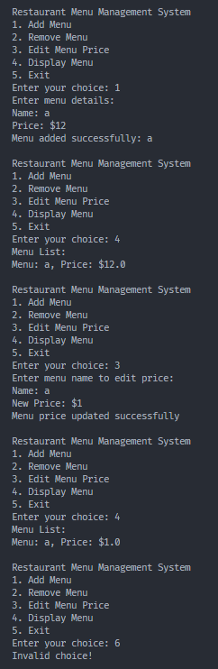

#### 
Refrence from GPT4, Gemini, GitHub Copilot, W3School, Dicoding, Geeksforgeeks

# 
Jurnal 02: Generic dan ArrayList

### 
By. Brindawan Yoga

<!-- <h1 align="center">Jurnal 02: Generic dan ArrayList</h1> -->

## Tujuan pembelajaran

#### Dalam kegiatan pembelajaran ini, mahasiswa diharapkan dapat memahami konsep generic dan ArrayList dalam pemrograman Java serta mampu mengimplementasikannya dalam pengembangan perangkat lunak. 

#### Tujuan utama dari kegiatan pembelajaran ini adalah:

1. Memahami konsep generic dalam Java.
2. Mengerti penggunaan ArrayList sebagai struktur data dinamis dalam Java.
3. Mampu merancang kelas generik untuk menangani berbagai jenis objek atau data.
4. Mampu mengimplementasikan fungsi-fungsi dasar seperti menambah, menghapus, dan mengedit data dalam struktur data ArrayList.

5. Mampu mengimplementasikan program sederhana untuk manajemen data menggunakan konsep generic dan ArrayList.

---

## Soal Jurnal

#### Anda diminta untuk membuat sebuah program sederhana untuk manajemen daftar kontak menggunakan Java. Program tersebut harus memiliki fungsi-fungsi berikut:

1. Menambahkan menu baru ke dalam daftar menu.
2. Menghapus menu dari daftar menu berdasarkan nama menu.
3. Mengedit harga menu dari menu yang sudah ada dalam daftar menu.
4. Menampilkan daftar menu yang ada.
5. Buatlah syntax Java lengkap untuk implementasi program di atas menggunakan konsep generic dan ArrayList!

---
## Petunjuk

1. Gunakan konsep generic untuk membuat kelas `MenuManager` agar dapat menangani berbagai jenis menu.
2. Implementasikan kelas `MenuItem` untuk merepresentasikan sebuah menu dengan atribut nama dan harga.
3. Buatlah menu interaktif yang memungkinkan pengguna memilih opsi yang diinginkan, seperti menambahkan menu baru, menghapus menu, mengedit harga menu, dan menampilkan daftar menu.
4. Pastikan untuk melakukan validasi input dari pengguna dan memberikan pesan kesalahan jika diperlukan.
5. Gunakan `Scanner` untuk mengambil input dari pengguna.
6. Implementasikan fungsi-fungsi dasar seperti menambah, menghapus, dan mengedit menu sesuai dengan petunjuk yang diberikan.
7. Tampilkan output dengan format yang jelas dan informatif untuk setiap tindakan yang dilakukan pengguna.

Dengan mengikuti petunjuk di atas, Anda dapat membuat sebuah program sederhana untuk manajemen menu restoran menggunakan konsep generic dan ArrayList dalam Java.

### contoh ketika program di jalankan

---

## Referensi Belajar

1. **W3 Schools - ArrayList in Java**: [Link](https://www.w3schools.com/java/java_arraylist.asp)
   - Artikel ini menjelaskan ArrayList dalam Java secara lengkap, mulai dari pengenalan, cara penggunaan, hingga operasi-operasi yang bisa dilakukan dengan ArrayList.

2. **Geeksforgeeks - Generics in Java**: [Link](https://www.geeksforgeeks.org/generics-in-java/)
   - Artikel ini memberikan pemahaman dasar tentang generic types dalam Java, termasuk pengenalan, keuntungan, serta contoh penggunaannya dalam berbagai situasi.

3. **Dicoding - Pemrograman Dengan Java**: [Link](https://www.dicoding.com/academies/60)
   - Kamu dapat mempelajari Java dengan cukup mendalam sampai dengan OOP secara gratis pada website ini, selain itu kamu juga dapat menggunakan forum diskusi Dicoding untuk bertanya jika terdapat kesulitan dalam belajar Java.

---
